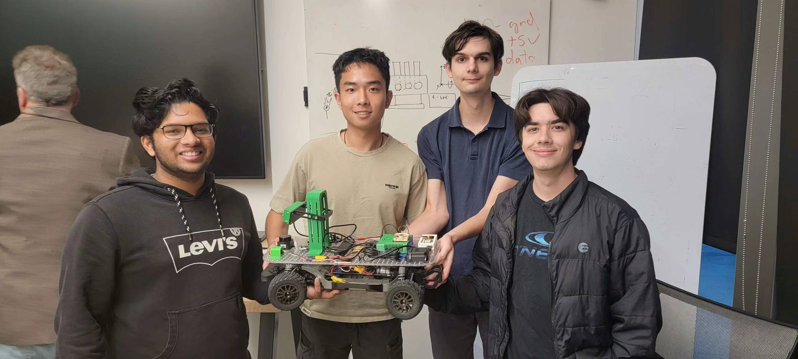
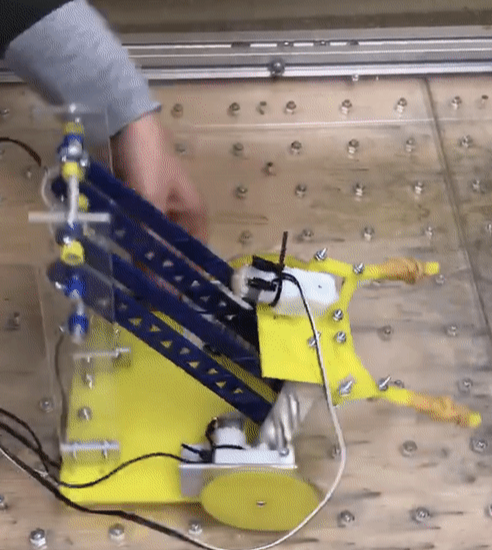

# 👋 Hi, I’m Yulin (Jason) Liu

**Mechanical Engineer | Robotics & Automation | Controls | Manufacturing**  
🔍 Actively seeking full-time roles | 💼 UC San Diego ’25 | 📫 [yul202@ucsd.edu](mailto:yul202@ucsd.edu)  
[LinkedIn](https://www.linkedin.com/in/yulin-liu-473862230/) | [GitHub](https://github.com/JL2200)  

---

## 🔧 Skills & Tools

- **Programming**: Python, C++, MATLAB, LabVIEW
- **Design & Simulation**: SolidWorks, Fusion 360, AutoCAD, ANSYS
- **Hardware**: Arduino, Raspberry Pi, FANUC Robot, PLCs (Allen-Bradley, Siemens)
- **Languages**: English, Mandarin, Cantonese

---

## 📁 Projects

### 🧬 Cellxercise Machine (Biomechanical Culture Reactor)
Musculoskeletal injuries require lab-based mechanical stimulation for tissue regeneration. Our system advances tissue engineering by applying both cyclic tension and compression inside a sterilizable, incubator-safe environment.

- Dual-mode mechanical loading (up to 20N at 1Hz)
- Real-time force feedback, LabVIEW control, reusable modular clamps
- Improved over commercial systems like ShellPa Pro

**Figures:**
- 
- 

---

### 🚗 Autonomous Vehicle Robot
Built a fully functioning autonomous vehicle from scratch.

- Lane detection with OpenCV, GPS, and LiDAR
- Integrated ChatGPT for dynamic path generation
- ROS2-based, using Jetson Nano, DonkeyCar, OakD, and Point One GPS

📎 [Project GitHub Repo](https://github.com/JL2200/mae148_group8)

**Figures:**
- 
- 

---

### 🌀 Boomerang Aerodynamics Study
Led experiments and simulations on boomerang joint angles and flight stability.

- Conducted UWB-based field tests with MATLAB airflow simulations
- Data used for AIAA paper on wingtip deflection and orientation performance

**Figures:**
- 
- 

---

### 🤖 Robotic Lift Mechanism
Designed and built a competitive robot to transport blocks across simulated floors.

- Integrated claw, four-bar linkage, and drivetrain
- Double torque gear system with 1:4 ratio increased lift capacity by 30%
- Simulated and prototyped with SolidWorks and laser cutting

**Figures:**
- 
- 

---

### 🧪 Xtreme Materials Lab (UCSD)
Synthesized novel materials via solvothermal techniques.

- Glove box preparation, inert mixing of carbon-lithium precursors
- Centrifugation, ultrasonic treatment, and acid washing to ensure purity
- Focus on extreme environment material integrity

**Figure:**
- 

---

## 📄 Resume
[Download CV (PDF)](Jason_CV.pdf)

---

## 📬 Contact
**Email**: [yul202@ucsd.edu](mailto:yul202@ucsd.edu)  
**LinkedIn**: [linkedin.com/in/yulin-liu-473862230](https://www.linkedin.com/in/yulin-liu-473862230/)  

---

© 2025 Yulin (Jason) Liu
