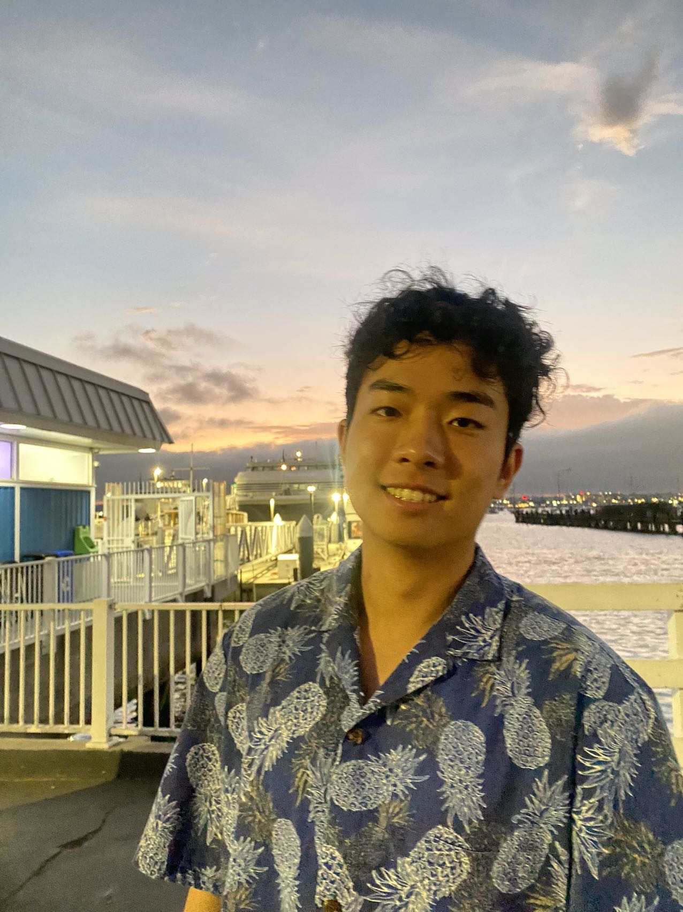
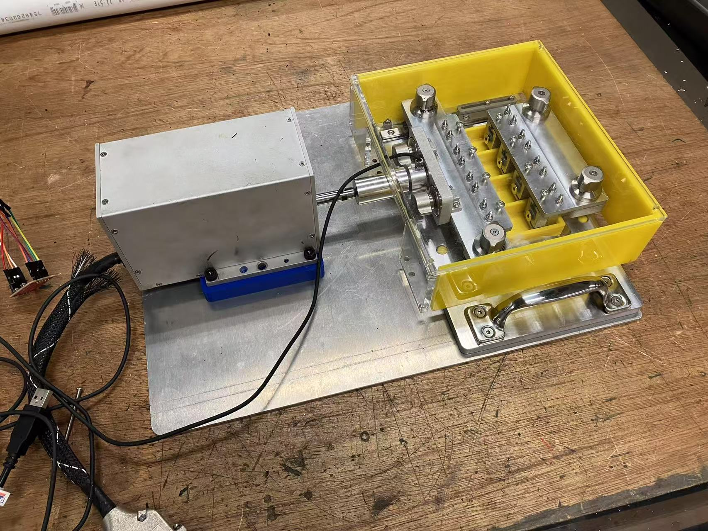
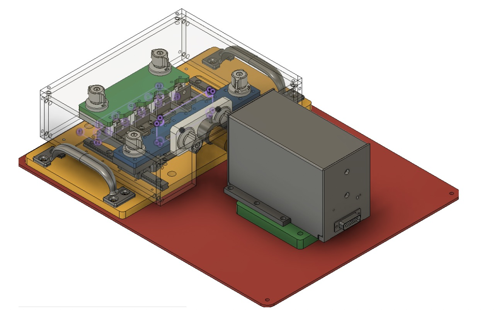
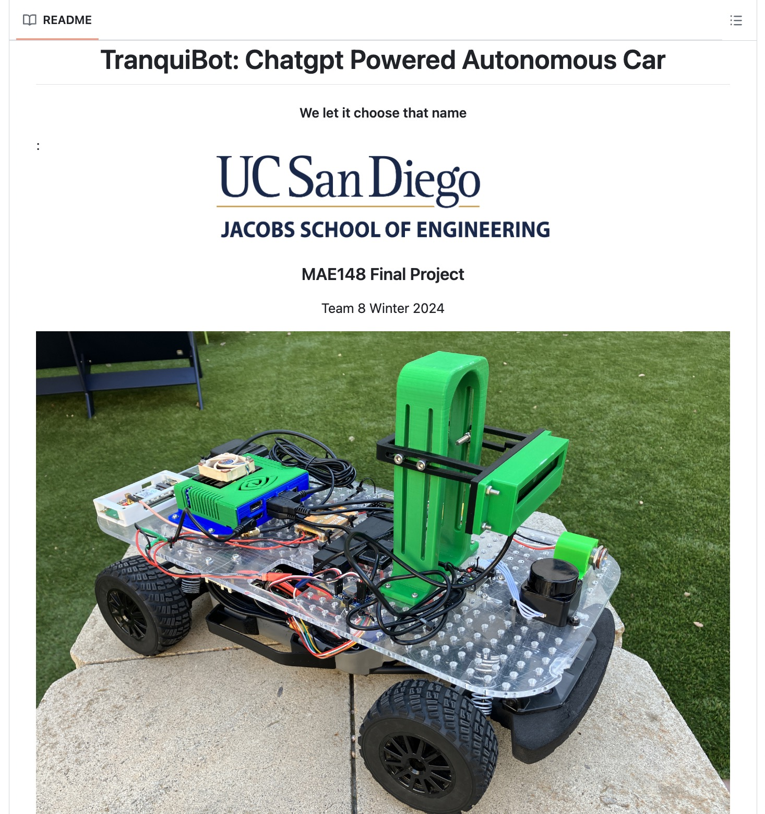
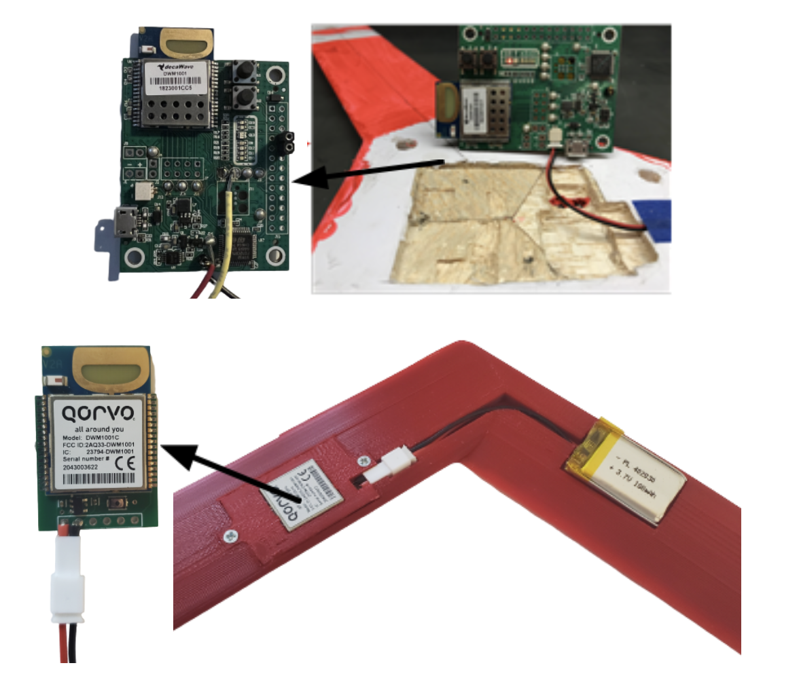
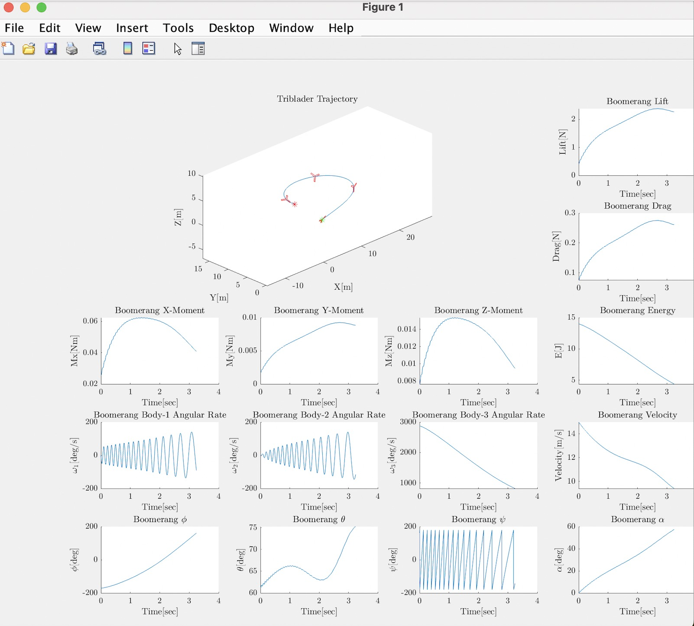
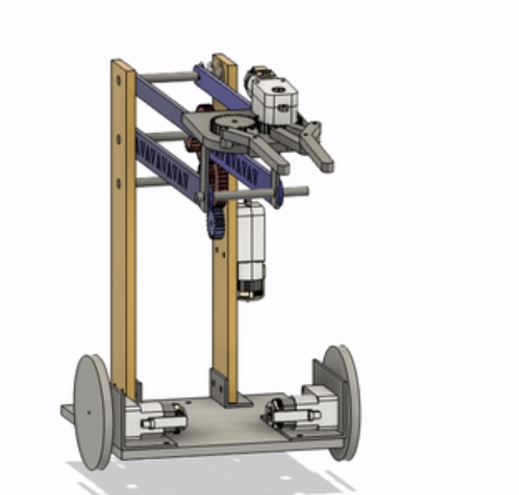
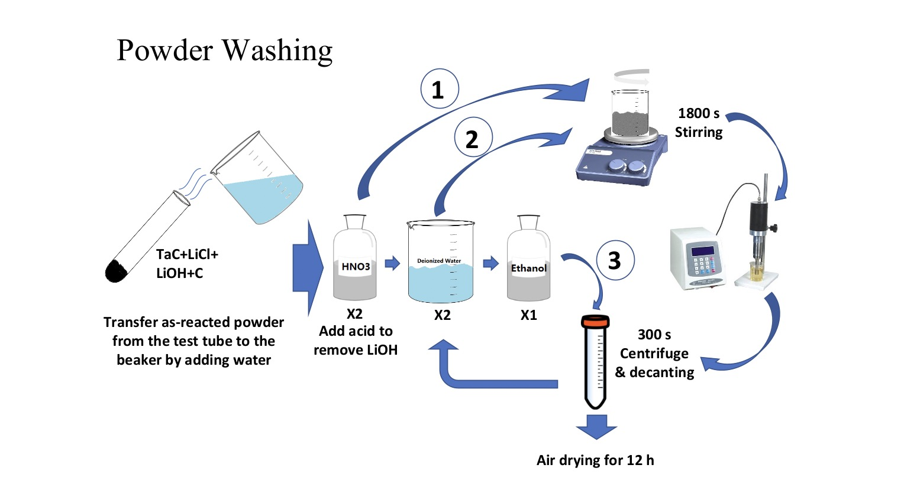

<!DOCTYPE html>
<html lang="en">
<head>
  <meta charset="UTF-8">
  <title>Yulin (Jason) Liu</title>
  <link rel="stylesheet" href="https://cdnjs.cloudflare.com/ajax/libs/github-markdown-css/5.2.0/github-markdown-light.min.css">
  
</head>
<body>
  

    <h1>yulinliu</h1>
    <a href="https://github.com/JL2200">View My GitHub Profile</a>
      
    
    
<strong>Yulin (Jason) Liu</strong>

    
Mechanical Engineering @ UC San Diego 
    Robotics | Automation | Biomechanics

    
📍 San Diego, CA

    
🌐 <a href="https://linkedin.com/in/yulin-liu-473862230">LinkedIn</a> 
    ✉️ <a href="mailto:yul202@ucsd.edu">Email</a> 
    🔗 <a href="https://github.com/JL2200">GitHub</a>

  

  

    <h2>About Me</h2>
    
I'm a mechanical engineer passionate about robotics, automation, and control systems. With hands-on experience at Trane Technologies and research labs at UC San Diego, I've led efforts in robotic integration, workflow optimization, and precision biomechanical system design. I thrive at the intersection of mechanical design, embedded systems, and human-centered engineering.

    <h2>🔬 Selected Projects</h2>

    <h3>🧬 Cellxercise Machine (Biomechanical Culture Reactor)</h3>
    
A dual-mode loading system applying tension and compression to tissue samples within a sterilizable, incubator-safe environment. Improved on commercial options by adding modular clamps, real-time feedback, and LabVIEW control.

    <ul>
      <li>Dual-mode cyclic loading (20N @ 1Hz)</li>
      <li>Tool-less disassembly, aluminum/stainless steel build</li>
      <li>Custom UI with LabVIEW for cycle control</li>
    </ul>
    
    

    <h3>🚗 Autonomous Vehicle Robot</h3>
    
Lane-detecting robot controlled via ChatGPT and ROS2, built from scratch using Jetson Nano, OpenCV, and DonkeyCar.

    <ul>
      <li>Integrated GPS, LiDAR, OakD, and ChatGPT API</li>
      <li>Future goals: full autonomy and safety stop</li>
    </ul>
    
📌 <a href="https://github.com/JL2200/mae148_group8">Project GitHub Repo</a>

    
    

    <h3>🌀 Boomerang Aerodynamics Study</h3>
    
Led UWB field tests and MATLAB simulations on joint-angle performance, contributing to an AIAA publication.

    <ul>
      <li>15+ field trials under controlled wind conditions</li>
      <li>Simulated airflow behavior in MATLAB</li>
    </ul>
    
    

    <h3>🤖 Robotic Lift Mechanism</h3>
    
Competitive robot with claw and four-bar lift, optimized for torque and elevation handling.

    <ul>
      <li>Laser-cut design, SolidWorks-based</li>
      <li>1:4 double torque gear system</li>
    </ul>
    
    

    <h3>🧪 Xtreme Materials Lab (UCSD)</h3>
    
Executed solvothermal synthesis in inert glove box environment; focused on producing high-purity materials for extreme condition research.

    <ul>
      <li>Carbon-lithium precursor mixing, acid washing</li>
      <li>Centrifugation + ultrasonic refinement</li>
    </ul>
    

    <h2>📄 Resume</h2>
    
<a href="Jason_CV.pdf">Download CV (PDF)</a>

    <h2>📩 Contact</h2>
    
<strong>Email:</strong> <a href="mailto:yul202@ucsd.edu">yul202@ucsd.edu</a> 
       <strong>LinkedIn:</strong> <a href="https://linkedin.com/in/yulin-liu-473862230">linkedin.com/in/yulin-liu-473862230</a>
    

      
    
© 2025 Yulin (Jason) Liu

  

</body>
</html>
